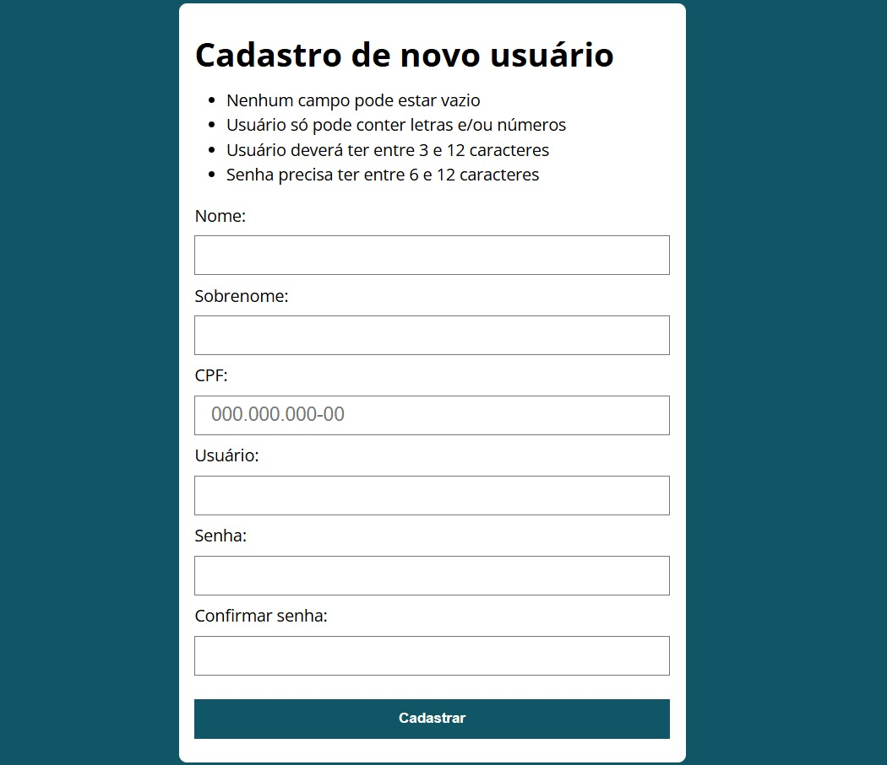
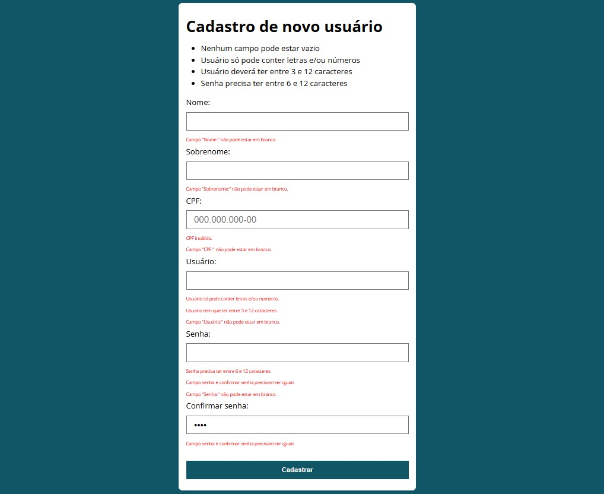

# 📝 UserRegistration

## 📌 Descrição
Projeto de **registro de usuário** desenvolvido com HTML, CSS e JavaScript.  
A página apresenta um formulário de cadastro com regras de validação e integração com o módulo **IsValidCPF** para verificar se o CPF informado é válido antes de registrar o usuário.

---

## ⚙️ Regras de cadastro
1. Nenhum campo pode estar vazio.  
2. Usuário só pode conter letras e/ou números.  
3. Usuário deve ter entre **3 e 12 caracteres**.  
4. Senha precisa ter entre **6 e 12 caracteres**.  
5. As duas senhas precisam ser **iguais**.  
6. O CPF informado deve ser **válido** (verificação feita pelo arquivo `IsValidCPF.js`).  

Caso alguma dessas exigências não seja cumprida, o formulário não é enviado e aparece uma mensagem de erro.

---

## 📋 Informações solicitadas
- Nome  
- Sobrenome  
- CPF  
- Usuário  
- Senha  
- Confirmar senha  

---

## 🛠️ Tecnologias utilizadas
- HTML5  
- CSS3  
- JavaScript (JS)  
  - `cadastro.js` → responsável pelo cadastro e validações  
  - `IsValidCPF.js` → responsável pela verificação do CPF  

---

## 📸 Preview
### 🔹 Tela inicial


### 🔹 Exemplo de erros


---

## 🚀 Como visualizar

Você pode abrir o projeto localmente:

1. Baixe ou clone este repositório:
   - Clique em **Code > Download ZIP** e extraia os arquivos  
   - ou use o comando:
     ```bash
     git clone https://github.com/WellingthonSchuh/UserRegistration.git
     ```

2. Abra o arquivo `index.html` em qualquer navegador moderno.

Ou

1. Acesse o site:
   - https://wellingthonschuh.github.io/UserRegistration/

> ⚠️ O projeto é totalmente seguro. Nenhum dado é armazenado em servidor — todas as validações são feitas localmente no navegador.

---

## 📚 Aprendizados
- Criação de formulários com HTML e CSS  
- Validação de campos com JavaScript  
- Uso de expressões regulares para restringir caracteres  
- Integração entre múltiplos arquivos JS (`main.js` e `IsValidCPF.js`)  
- Exibição de mensagens de erro e bloqueio de envio quando regras não são cumpridas  

---

## 👨‍💻 Autor
Feito por **Wellingthon Schuh**  
🔗 [LinkedIn](https://www.linkedin.com/in/wellingthonschuh)
